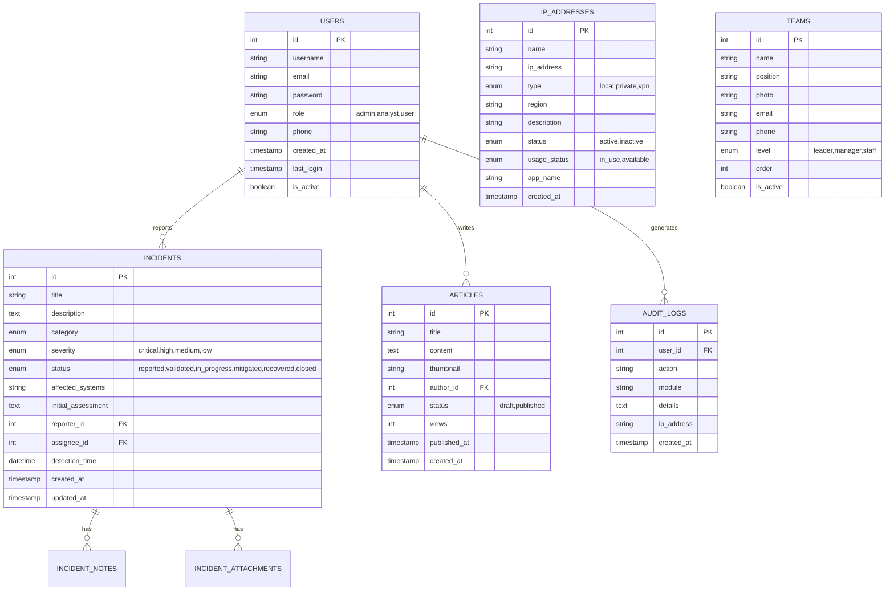

# CSIRT RRI Application Blueprint

## Dokumen Arsitektur & Spesifikasi Aplikasi
**Versi**: 1.0  
**Tanggal**: 20 Januari 2026

---

## 1. Konsep Aplikasi

### 1.1 Gambaran Umum
**CSIRT RRI** (Computer Security Incident Response Team Radio Republik Indonesia) adalah aplikasi web untuk mengelola keamanan siber dan respons insiden di lingkungan RRI. Aplikasi ini menggabungkan:

- **Landing Page Publik** - Informasi tentang CSIRT, berita keamanan, dan pelaporan insiden
- **Admin Panel** - Manajemen insiden, pengguna, konten, dan infrastruktur IT

### 1.2 Tujuan Aplikasi

| Tujuan | Deskripsi |
|--------|-----------|
| **Respons Insiden** | Menerima, memvalidasi, dan menangani laporan insiden keamanan siber |
| **Manajemen Infrastruktur** | Monitoring dan pengelolaan IP Address di seluruh daerah |
| **Edukasi Publik** | Menyebarkan informasi keamanan siber melalui artikel |
| **Transparansi** | Menampilkan tim CSIRT dan informasi kontak |
| **Pelaporan** | Menyediakan laporan statistik insiden dan aktivitas |

### 1.3 Target Pengguna


---

## 2. Arsitektur Sistem

### 2.1 Technology Stack

| Layer | Teknologi |
|-------|-----------|
| **Backend** | PHP 7.4+ dengan CodeIgniter 3 |
| **Frontend** | HTML5, Tailwind CSS, Alpine.js |
| **Database** | MySQL 5.7+ |
| **Server** | Apache/Nginx atau PHP Built-in Server |

### 2.2 Struktur Direktori

```
RRI-CSIRT/
├── application/
│   ├── controllers/     # 7 Controllers
│   ├── models/          # Database models
│   ├── views/
│   │   ├── admin/       # Admin panel views
│   │   ├── landing/     # Public pages
│   │   └── templates/   # Reusable templates
│   └── config/          # Konfigurasi aplikasi
├── assets/              # CSS, JS, Images
└── system/              # CodeIgniter core
```

---

## 3. Database Schema (ERD)

### 3.1 Tabel Utama



### 3.2 Kategori Insiden

| Kode | Label |
|------|-------|
| `malware` | Malware/Virus |
| `phishing` | Phishing |
| `ddos` | DDoS Attack |
| `unauthorized_access` | Akses Tidak Sah |
| `data_breach` | Kebocoran Data |
| `defacement` | Defacement |
| `other` | Lainnya |

---

## 4. Fitur Aplikasi

### 4.1 Landing Page (Publik)

| Halaman | Fitur |
|---------|-------|
| **Home** | Hero section, statistik, berita terbaru, widget cuaca, quick report |
| **Artikel** | Daftar artikel keamanan, filter kategori, pencarian |
| **Detail Artikel** | Konten lengkap, share sosmed, artikel terkait |
| **Tentang Kami** | Profil CSIRT, visi misi, kontak |
| **Tim** | Struktur organisasi dengan kartu anggota |
| **Kontak** | Form kontak, peta lokasi, info kontak |

### 4.2 Admin Panel

#### Dashboard
- Statistik insiden (total, open, resolved)
- Grafik tren insiden bulanan
- Aktivitas terbaru
- Quick actions

#### Manajemen Insiden
- **Daftar Insiden** - Filter status/severity, search, pagination
- **Lapor Insiden** - Form lengkap dengan file attachment
- **Detail Insiden** - Timeline aktivitas, catatan, update status, assign analyst

#### Manajemen Konten
- **Artikel** - CRUD artikel, upload gambar, draft/publish
- **Tim** - Kelola anggota tim, foto, posisi

#### Infrastruktur
- **Manajemen IP** - Unified view semua IP (Local/Private/VPN)
  - Filter berdasarkan tipe, daerah, status penggunaan
  - Search across all types
  - Status: Digunakan (+ nama aplikasi) / Tersedia

#### Administrasi
- **Pengguna** - Kelola user, role assignment
- **Audit Log** - Riwayat aktivitas sistem
- **Laporan** - Generate laporan statistik
- **Pengaturan** - Konfigurasi aplikasi

### 4.3 Fitur Sistem

| Fitur | Deskripsi |
|-------|-----------|
| **Dark Mode** | Toggle light/dark theme di admin panel |
| **Responsive** | Mendukung mobile, tablet, desktop |
| **CSRF Protection** | Keamanan form submission |
| **Role-based Access** | Admin, Analyst, User permissions |
| **Session Management** | Secure login/logout |

---

## 5. User Interface Design

### 5.1 Design System

#### Colors
```css
/* Primary */
--rri-navy: #0A1628;
--rri-blue: #1E40AF;
--rri-gold: #D4AF37;

/* Dark Mode */
--slate-800: #1E293B;
--slate-900: #0F172A;

/* Status Colors */
--critical: #EF4444;
--high: #F97316;
--medium: #EAB308;
--low: #22C55E;
```

#### Typography
- **Font**: Inter (Google Fonts)
- **Headings**: Bold, 600-700 weight
- **Body**: Regular, 400-500 weight

### 5.2 Layout Admin Panel

```
┌─────────────────────────────────────────────────────────────┐
│                      CSIRT RRI                              │
├──────────┬──────────────────────────────────────────────────┤
│          │  Header (Fixed)                    🔔 👤        │
│ Sidebar  ├──────────────────────────────────────────────────┤
│          │                                                  │
│ Dashboard│  Main Content Area                              │
│ Incidents│  (Independent Scroll)                           │
│ Articles │                                                  │
│ Teams    │  ┌─────────┐ ┌─────────┐ ┌─────────┐           │
│ IP Mgmt  │  │Stats    │ │Stats    │ │Stats    │           │
│ -------- │  └─────────┘ └─────────┘ └─────────┘           │
│ Users    │                                                  │
│ Audit    │  ┌─────────────────────────────────────────┐    │
│ Settings │  │ Data Table / Content                    │    │
│          │  └─────────────────────────────────────────┘    │
│ (Scroll) │                                                  │
└──────────┴──────────────────────────────────────────────────┘
```

### 5.3 Komponen UI

| Komponen | Deskripsi |
|----------|-----------|
| **Cards** | Rounded corners, shadow, border, dark mode support |
| **Tables** | Striped rows, hover effect, responsive |
| **Buttons** | Gradient primary, outlined secondary |
| **Inputs** | Focus ring, dark background support |
| **Badges** | Colored pills for status/severity |
| **Sidebar** | Fixed, navy gradient, collapsible on mobile |

---

## 6. API Endpoints (Routes)

### 6.1 Public Routes
```
GET  /                     - Landing home
GET  /about                - About page
GET  /artikel              - Article list
GET  /artikel/:slug        - Article detail
GET  /team                 - Team page
GET  /contact              - Contact page
```

### 6.2 Auth Routes
```
GET  /auth/login           - Login page
POST /auth/login           - Process login
GET  /auth/logout          - Logout
```

### 6.3 Admin Routes
```
GET  /dashboard            - Admin dashboard
GET  /incidents            - Incident list
GET  /incidents/create     - Create incident form
POST /incidents/store      - Save incident
GET  /incidents/:id        - Incident detail
POST /incidents/:id/notes  - Add note

GET  /admin/articles       - Article management
GET  /admin/teams          - Team management
GET  /admin/ip-management  - IP Address management
GET  /admin/users          - User management
GET  /admin/audit          - Audit logs
GET  /admin/reports        - Reports
GET  /admin/settings       - Settings
```

---

## 7. Keamanan

### 7.1 Implementasi Keamanan

| Aspek | Implementasi |
|-------|--------------|
| **Authentication** | Session-based login dengan password hash |
| **Authorization** | Role-based access control (RBAC) |
| **CSRF** | Token validation pada semua form |
| **XSS** | htmlspecialchars() pada output |
| **SQL Injection** | Query builder / prepared statements |
| **File Upload** | Validasi ekstensi dan ukuran |

### 7.2 Role Permissions

| Fitur | Admin | Analyst | User |
|-------|-------|---------|------|
| Dashboard | ✓ | ✓ | ✓ |
| View Incidents | ✓ | ✓ | Own |
| Create Incident | ✓ | ✓ | ✓ |
| Update Status | ✓ | ✓ | ✗ |
| Manage Users | ✓ | ✗ | ✗ |
| Audit Logs | ✓ | ✗ | ✗ |
| Settings | ✓ | ✗ | ✗ |

---

## 8. Roadmap Pengembangan

### Phase 1 (Current) ✓
- [x] Landing page dengan dark mode
- [x] Admin dashboard dengan statistik
- [x] Incident management system
- [x] Article management
- [x] Team management
- [x] IP Address management
- [x] User management
- [x] Responsive design

### Phase 2 (Planned)
- [ ] Database integration (MySQL)
- [ ] Email notifications
- [ ] Real-time incident updates
- [ ] Advanced reporting with export
- [ ] API for external integration

### Phase 3 (Future)
- [ ] Mobile app integration
- [ ] Threat intelligence feed
- [ ] Automated incident classification
- [ ] Integration dengan SIEM

---

## 9. Deployment

### 9.1 Requirements
- PHP 7.4 atau lebih tinggi
- MySQL 5.7 atau lebih tinggi
- Apache/Nginx dengan mod_rewrite
- Composer (optional)

### 9.2 Konfigurasi
1. Set `base_url` di `application/config/config.php`
2. Konfigurasi database di `application/config/database.php`
3. Set `encryption_key` untuk keamanan session
4. Enable `.htaccess` untuk clean URLs

---

*Dokumen ini dibuat sebagai referensi teknis untuk pengembangan dan maintenance aplikasi CSIRT RRI.*
