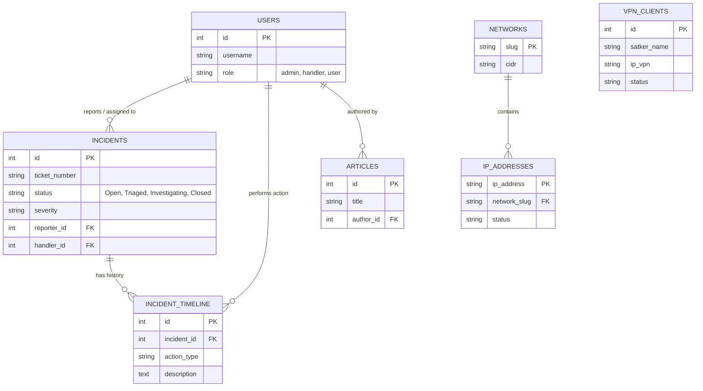

# CSIRT RRI - Blueprint & Dokumentasi Sistem

Dokumen ini berfungsi sebagai cetak biru (blueprint) dan dokumentasi teknis untuk pengembangan dan pemeliharaan website **CSIRT RRI (Computer Security Incident Response Team)**.

## 1. Tujuan Website (Purpose)

Sistem ini dibangun dengan tujuan utama untuk mendukung operasional keamanan siber di lingkungan LPP RRI. Penjabaran tujuan spesifik meliputi:

### A. Manajemen Insiden Terpusat
*   **Sentralisasi Laporan**: Menyediakan satu pintu untuk pelaporan insiden keamanan (siber, fisik, atau anomali jaringan).
*   **Tracking & Monitoring**: Memantau status penanganan insiden secara real-time dari tahap pelaporan, triase, investigasi, hingga penutupan (closure).
*   **Audit Trail**: Merekam setiap tindakan yang diambil oleh tim respon insiden untuk keperluan audit dan evaluasi.

### B. Manajemen Infrastruktur Jaringan (IP Management)
*   **Inventarisasi IP**: Mendokumentasikan penggunaan IP Publik dan IP VPN di seluruh satuan kerja (Satker) RRI.
*   **Monitoring Status**: Memantau status konektivitas (Online/Offline) dan ketersediaan IP.
*   **Visualisasi Data**: Menampilkan distribusi penggunaan jaringan untuk memudahkan pengambilan keputusan topologi.

### C. Edukasi & Informasi
*   **Portal Berita Keamanan**: Menyebarkan informasi terkini mengenai ancaman siber dan tips keamanan kepada seluruh pegawai.
*   **Knowledge Base**: Menyimpan prosedur standar (SOP) dan panduan mitigasi.

---

## 2. Struktur Database (ERD & Relasi)

### Visualisasi ERD (Entity Relationship Diagram)

### Penjelasan Tabel Utama
*   **`users`**: Data pengguna (Admin, Petugas, User).
*   **`incidents`**: Laporan insiden utama.
*   **`incident_timeline`**: Riwayat/Log aktivitas setiap insiden.
*   **`articles`**: Konten berita dan edukasi.
*   **`networks` & `ip_addresses`**: Manajemen IP Publik.
*   **`vpn_clients`**: Data koneksi VPN.

---

## 3. Dokumentasi Teknologi (Tech Stack)

Sistem dibangun menggunakan teknologi standar web yang stabil dan aman:

### Backend Framework
*   **Bahasa Pemrograman**: **PHP** (Kompatibel dengan PHP 7.4 - 8.x).
*   **Framework Utama**: **CodeIgniter 3** (Structure based: `application/controllers`, `application/views`).
*   **Database**: MySQL / MariaDB.

### Frontend & UI/UX
*   **Styling Engine**: **Tailwind CSS** (via CDN).
*   **Interaktivitas**: **Alpine.js**.
    *   Digunakan untuk interaksi *client-side* ringan (Tabs, Dropdown, Modal).

### External Services
*   **BMKG API**: Widget Cuaca dashboard.

---

## 4. Alur Kerja Sistem (System Workflows)

### A. Alur Penanganan Insiden (Incident Response Lifecycle)
1.  **Pelaporan**: User lapor via form -> Tiket dibuat (Status: Open).
2.  **Triase**: Admin set Severity & Assign Handler (Status: Triaged).
3.  **Investigasi**: Handler analisa log & bukti (Status: Investigating).
4.  **Mitigasi**: Perbaikan teknis dilakukan (Status: Mitigated).
5.  **Penutupan**: Laporan selesai & diverifikasi (Status: Closed).

### B. Alur Manajemen IP & VPN
1.  **IP Publik**: Visualisasi Grid warna (Kuning=Reserved, Putih=Used).
2.  **VPN Check**:
    *   Tab **Terhubung** (Hijau): Monitoring site Online.
    *   Tab **Belum Terkoneksi** (Merah): Monitoring site Offline.

### C. Alur Publikasi Konten
1.  **Drafting**: Admin tulis artikel.
2.  **Publishing**: Artikel tayang di halaman depan.
