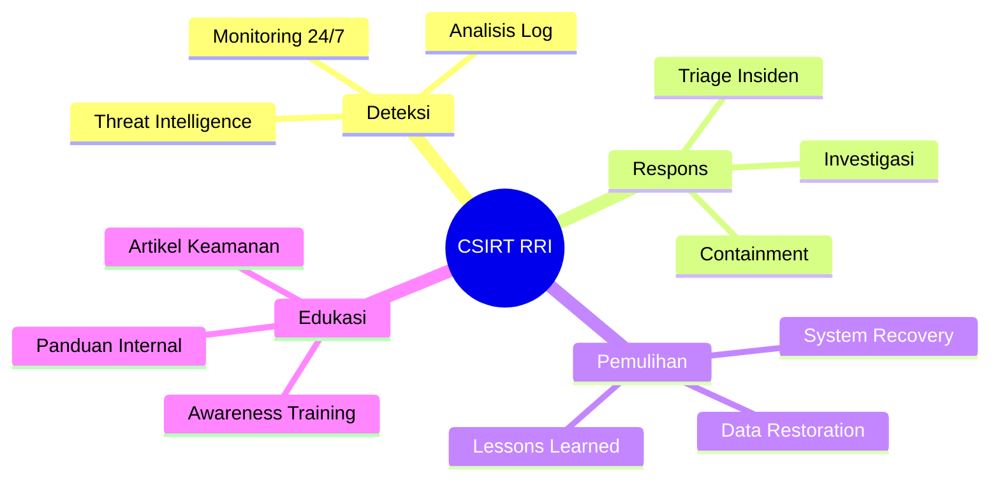
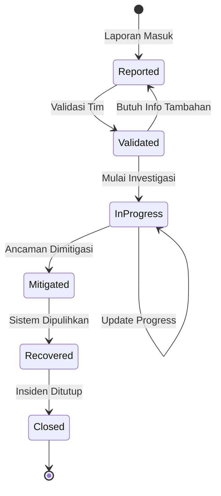
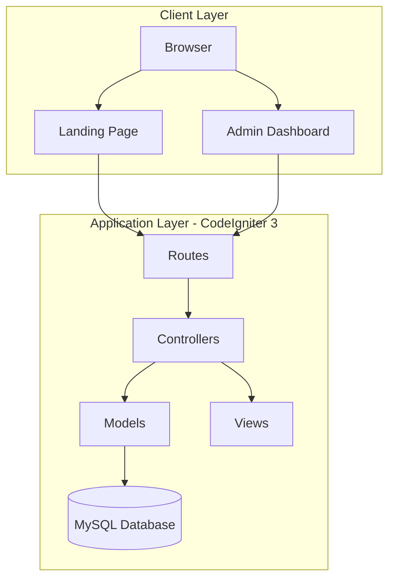
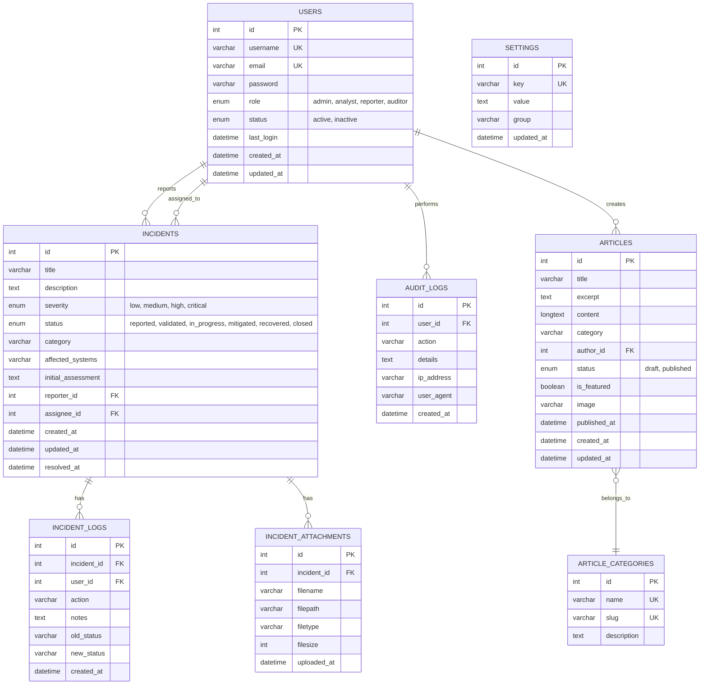

# 📘 Dokumentasi CSIRT RRI

**Versi**: 1.0  
**Tanggal**: 20 Januari 2026  
**Pengembang**: Tim Teknologi Media Baru RRI

---

## 📋 Daftar Isi

1. [Tentang Aplikasi](#-tentang-aplikasi)
2. [Tujuan CSIRT](#-tujuan-csirt)
3. [Fitur-Fitur Utama](#-fitur-fitur-utama)
4. [Arsitektur Sistem](#-arsitektur-sistem)
5. [UI/UX Design](#-uiux-design)
6. [ERD Database](#-erd-database)
7. [Struktur Folder](#-struktur-folder)
8. [Teknologi yang Digunakan](#-teknologi-yang-digunakan)
9. [Panduan Penggunaan](#-panduan-penggunaan)
10. [Keamanan](#-keamanan)

---

## 🎯 Tentang Aplikasi

**CSIRT RRI** (Computer Security Incident Response Team Radio Republik Indonesia) adalah aplikasi web internal yang dirancang untuk menangani, mencatat, dan mengelola insiden keamanan siber di lingkungan RRI.

Aplikasi ini terdiri dari dua bagian utama:
- **Landing Page (Publik)**: Company profile yang menampilkan informasi tentang tim CSIRT, layanan, dan artikel keamanan
- **Admin Dashboard (Internal)**: Panel administrasi untuk mengelola insiden, pengguna, artikel, dan laporan

---

## 🎯 Tujuan CSIRT

### Tujuan Utama

| No | Tujuan | Deskripsi |
|----|--------|-----------|
| 1 | **Deteksi Ancaman** | Mendeteksi dan mengidentifikasi ancaman keamanan siber secara dini |
| 2 | **Respons Insiden** | Memberikan respons cepat terhadap insiden keamanan dalam waktu < 1 jam |
| 3 | **Mitigasi Risiko** | Mengurangi dampak insiden dan mencegah penyebaran lebih lanjut |
| 4 | **Pemulihan Sistem** | Memastikan pemulihan sistem yang terdampak ke kondisi normal |
| 5 | **Dokumentasi** | Mendokumentasikan semua insiden untuk analisis dan pembelajaran |
| 6 | **Edukasi** | Meningkatkan kesadaran keamanan siber di lingkungan RRI |

### Ruang Lingkup Kerja



---

## ⭐ Fitur-Fitur Utama

### 🌐 A. Landing Page (Publik)

| Fitur | Deskripsi | URL |
|-------|-----------|-----|
| **Beranda** | Hero section dengan informasi layanan CSIRT | `/` |
| **Tentang** | Visi, misi, dan filosofi tim CSIRT RRI | `/tentang` |
| **Tim** | Profil anggota tim dengan keahlian masing-masing | `/tim` |
| **Artikel** | Daftar artikel keamanan siber dengan filter kategori | `/artikel` |
| **Kontak** | Informasi kontak dan form untuk menghubungi tim | `/kontak` |

### 🔐 B. Admin Dashboard

| Modul | Fungsi | URL |
|-------|--------|-----|
| **Dashboard** | Overview statistik insiden, grafik severity, dan quick actions | `/dashboard` |
| **Manajemen Insiden** | CRUD insiden, tracking status, assignment, dan timeline | `/incidents` |
| **Lapor Insiden** | Form untuk melaporkan insiden baru | `/incidents/create` |
| **Detail Insiden** | Timeline dan detail lengkap insiden | `/incidents/{id}` |
| **Manajemen Pengguna** | Kelola user dengan berbagai role | `/admin/users` |
| **Manajemen Artikel** | Publikasi dan pengelolaan artikel keamanan | `/admin/articles` |
| **Laporan** | Statistik dan laporan insiden bulanan/tahunan | `/admin/reports` |
| **Audit Log** | Catatan semua aktivitas pengguna untuk keamanan | `/admin/audit` |
| **Pengaturan** | Konfigurasi sistem dan preferensi pengguna | `/admin/settings` |

### 📊 C. Alur Status Insiden



### 📈 D. Level Severity Insiden

| Level | Warna | Deskripsi | Response Time |
|-------|-------|-----------|---------------|
| **Critical** | 🔴 Merah | Dampak kritis pada operasional | < 15 menit |
| **High** | 🟠 Orange | Dampak signifikan | < 1 jam |
| **Medium** | 🟡 Kuning | Dampak moderat | < 4 jam |
| **Low** | 🟢 Hijau | Dampak minimal | < 24 jam |

---

## 🏗 Arsitektur Sistem

### Arsitektur MVC (Model-View-Controller)



### Daftar Controllers

| Controller | File | Fungsi |
|------------|------|--------|
| **Landing** | `Landing.php` | Handle halaman publik (home, tentang, tim, kontak) |
| **Auth** | `Auth.php` | Handle autentikasi (login, logout) |
| **Dashboard** | `Dashboard.php` | Handle dashboard admin |
| **Incidents** | `Incidents.php` | Handle CRUD insiden |
| **Admin** | `Admin.php` | Handle panel administrasi (users, articles, reports, audit) |
| **Artikel** | `Artikel.php` | Handle halaman artikel publik |

### Komponen Sistem

| Layer | Komponen | Fungsi |
|-------|----------|--------|
| **Controllers** | Landing, Auth, Dashboard, Incidents, Admin, Artikel | Handle request dan business logic |
| **Views** | landing/*, admin/*, auth/*, templates/* | Presentasi data ke user |
| **Models** | User_model, Incident_model, Article_model, Audit_log_model | Akses dan manipulasi data |
| **Helpers** | url, form, security | Fungsi bantuan |
| **Libraries** | session, form_validation | Library tambahan |

---

## 🎨 UI/UX Design

### Design System

#### Color Palette

| Warna | Hex Code | Penggunaan |
|-------|----------|------------|
| **Navy Primary** | `#0d1b2a` | Background utama (dark mode) |
| **Navy Dark** | `#060d17` | Background gelap |
| **Blue Accent** | `#3b82f6` | Tombol, link, highlight |
| **Blue Light** | `#60a5fa` | Gradient accent |
| **Green (Success)** | `#22c55e` | Status resolved, aktif |
| **Red (Danger)** | `#ef4444` | Critical severity, error |
| **Orange (Warning)** | `#f97316` | High severity, perhatian |
| **Yellow** | `#eab308` | Medium severity |
| **Purple** | `#8b5cf6` | In-progress status |
| **White** | `#ffffff` | Text, cards (light mode) |
| **Gray** | `#94a3b8` | Secondary text |

#### Typography

```css
/* Font Family */
font-family: 'Inter', system-ui, sans-serif;

/* Font Weights */
font-weight: 300; /* Light */
font-weight: 400; /* Regular */
font-weight: 500; /* Medium */
font-weight: 600; /* SemiBold */
font-weight: 700; /* Bold */
font-weight: 800; /* ExtraBold */
```

### Komponen UI Utama

#### 1. Landing Page
- **Hero Section**: Gradient background dengan glassmorphism overlay
- **Stats Cards**: Animasi counter untuk statistik
- **Team Cards**: Grid layout dengan foto dan role
- **Article Cards**: Card dengan kategori badge dan tanggal
- **Contact Form**: Form dengan validasi real-time

#### 2. Login Page
- **Dark Theme**: Navy gradient dengan grid pattern
- **Glassmorphism**: Card login dengan backdrop blur
- **Form Validation**: Real-time feedback untuk input
- **Password Toggle**: Show/hide password button

#### 3. Admin Dashboard
- **Welcome Banner**: Personalized greeting dengan gradient
- **Stats Cards**: 4 KPI utama dengan color-coded icons
- **Recent Incidents Table**: List dengan severity indicator
- **Severity Chart**: Progress bar distribution
- **Quick Actions**: Shortcut buttons untuk aksi umum
- **System Status**: Monitoring status dengan indicator

### Responsive Design

| Breakpoint | Screen Size | Layout |
|------------|-------------|--------|
| **Mobile** | < 640px | Single column, hamburger menu |
| **Tablet** | 640px - 1024px | 2 columns, collapsed sidebar |
| **Desktop** | > 1024px | Full layout, expanded sidebar |

### Visual Effects

```css
/* Glassmorphism */
.glass {
    background: rgba(255, 255, 255, 0.05);
    backdrop-filter: blur(12px);
    -webkit-backdrop-filter: blur(12px);
    border: 1px solid rgba(255, 255, 255, 0.1);
}

/* Soft Shadows */
box-shadow: 0 1px 3px 0 rgb(0 0 0 / 0.1);  /* shadow-sm */
box-shadow: 0 4px 6px -1px rgb(0 0 0 / 0.1); /* shadow-md */

/* Micro-animations */
transition: all 0.3s ease;

/* Gradient Text */
.gradient-text {
    background: linear-gradient(135deg, #60a5fa 0%, #3b82f6 100%);
    -webkit-background-clip: text;
    -webkit-text-fill-color: transparent;
}
```

---

## 🗃 ERD Database

### Entity Relationship Diagram



### Deskripsi Tabel

| Tabel | Deskripsi | Kolom Utama |
|-------|-----------|-------------|
| `users` | Data pengguna sistem | id, username, email, password, role, status |
| `incidents` | Laporan insiden keamanan | id, title, severity, status, reporter_id, assignee_id |
| `incident_logs` | Timeline perubahan status insiden | id, incident_id, action, old_status, new_status |
| `incident_attachments` | File lampiran (screenshot, log) | id, incident_id, filename, filepath |
| `audit_logs` | Log aktivitas pengguna | id, user_id, action, details, ip_address |
| `articles` | Artikel keamanan siber | id, title, content, category, status |
| `article_categories` | Kategori artikel | id, name, slug |
| `settings` | Konfigurasi sistem | id, key, value, group |

### Kategori Insiden

| Kode | Nama | Deskripsi |
|------|------|-----------|
| `malware` | Malware/Ransomware | Infeksi malware pada sistem |
| `phishing` | Phishing | Email atau website palsu |
| `unauthorized_access` | Akses Tidak Sah | Percobaan masuk tanpa izin |
| `data_breach` | Kebocoran Data | Data sensitif terekspos |
| `ddos` | DDoS Attack | Serangan denial of service |
| `defacement` | Website Defacement | Perubahan tampilan website |
| `other` | Lainnya | Insiden lain yang tidak terkategori |

### SQL Schema

```sql
-- Tabel Users
CREATE TABLE users (
    id INT PRIMARY KEY AUTO_INCREMENT,
    username VARCHAR(50) UNIQUE NOT NULL,
    email VARCHAR(100) UNIQUE NOT NULL,
    password VARCHAR(255) NOT NULL,
    role ENUM('admin', 'analyst', 'reporter', 'auditor') DEFAULT 'reporter',
    status ENUM('active', 'inactive') DEFAULT 'active',
    last_login DATETIME,
    created_at DATETIME DEFAULT CURRENT_TIMESTAMP,
    updated_at DATETIME ON UPDATE CURRENT_TIMESTAMP
);

-- Tabel Incidents  
CREATE TABLE incidents (
    id INT PRIMARY KEY AUTO_INCREMENT,
    title VARCHAR(255) NOT NULL,
    description TEXT,
    severity ENUM('low', 'medium', 'high', 'critical') NOT NULL,
    status ENUM('reported', 'validated', 'in_progress', 'mitigated', 'recovered', 'closed') DEFAULT 'reported',
    category VARCHAR(50),
    affected_systems VARCHAR(255),
    initial_assessment TEXT,
    reporter_id INT,
    assignee_id INT,
    created_at DATETIME DEFAULT CURRENT_TIMESTAMP,
    updated_at DATETIME ON UPDATE CURRENT_TIMESTAMP,
    resolved_at DATETIME,
    FOREIGN KEY (reporter_id) REFERENCES users(id),
    FOREIGN KEY (assignee_id) REFERENCES users(id)
);

-- Tabel Incident Logs
CREATE TABLE incident_logs (
    id INT PRIMARY KEY AUTO_INCREMENT,
    incident_id INT NOT NULL,
    user_id INT NOT NULL,
    action VARCHAR(100) NOT NULL,
    notes TEXT,
    old_status VARCHAR(50),
    new_status VARCHAR(50),
    created_at DATETIME DEFAULT CURRENT_TIMESTAMP,
    FOREIGN KEY (incident_id) REFERENCES incidents(id),
    FOREIGN KEY (user_id) REFERENCES users(id)
);

-- Tabel Audit Logs
CREATE TABLE audit_logs (
    id INT PRIMARY KEY AUTO_INCREMENT,
    user_id INT,
    action VARCHAR(100) NOT NULL,
    details TEXT,
    ip_address VARCHAR(45),
    user_agent TEXT,
    created_at DATETIME DEFAULT CURRENT_TIMESTAMP,
    FOREIGN KEY (user_id) REFERENCES users(id)
);

-- Tabel Articles
CREATE TABLE articles (
    id INT PRIMARY KEY AUTO_INCREMENT,
    title VARCHAR(255) NOT NULL,
    excerpt TEXT,
    content LONGTEXT,
    category VARCHAR(50),
    author_id INT,
    status ENUM('draft', 'published') DEFAULT 'draft',
    is_featured BOOLEAN DEFAULT FALSE,
    image VARCHAR(255),
    published_at DATETIME,
    created_at DATETIME DEFAULT CURRENT_TIMESTAMP,
    updated_at DATETIME ON UPDATE CURRENT_TIMESTAMP,
    FOREIGN KEY (author_id) REFERENCES users(id)
);
```

---

## 📁 Struktur Folder

```
RRI-CSIRT/
├── 📄 .htaccess                    # Apache rewrite rules
├── 📄 index.php                    # Entry point aplikasi
├── 📄 composer.json                # PHP dependencies
├── 📄 README.md                    # Dokumentasi ini
│
├── 📁 application/
│   ├── 📁 config/
│   │   ├── 📄 autoload.php         # Autoload libraries & helpers
│   │   ├── 📄 config.php           # Konfigurasi aplikasi
│   │   ├── 📄 database.php         # Konfigurasi database
│   │   └── 📄 routes.php           # Routing URL
│   │
│   ├── 📁 controllers/
│   │   ├── 📄 Admin.php            # Controller admin panel
│   │   ├── 📄 Artikel.php          # Controller artikel publik
│   │   ├── 📄 Auth.php             # Controller autentikasi
│   │   ├── 📄 Dashboard.php        # Controller dashboard
│   │   ├── 📄 Incidents.php        # Controller manajemen insiden
│   │   └── 📄 Landing.php          # Controller landing page
│   │
│   ├── 📁 models/
│   │   ├── 📄 Article_model.php    # Model artikel
│   │   ├── 📄 Audit_log_model.php  # Model audit log
│   │   ├── 📄 Incident_model.php   # Model insiden
│   │   └── 📄 User_model.php       # Model user
│   │
│   └── 📁 views/
│       ├── 📁 admin/
│       │   ├── 📁 templates/
│       │   │   ├── 📄 header.php   # Header admin
│       │   │   ├── 📄 sidebar.php  # Sidebar navigation
│       │   │   └── 📄 footer.php   # Footer admin
│       │   ├── 📁 incidents/
│       │   │   ├── 📄 index.php    # Daftar insiden
│       │   │   ├── 📄 create.php   # Form buat insiden
│       │   │   └── 📄 detail.php   # Detail insiden
│       │   ├── 📄 dashboard.php    # Halaman dashboard
│       │   ├── 📄 users.php        # Manajemen user
│       │   ├── 📄 articles.php     # Manajemen artikel
│       │   ├── 📄 reports.php      # Laporan
│       │   ├── 📄 audit.php        # Audit log
│       │   └── 📄 settings.php     # Pengaturan
│       │
│       ├── 📁 auth/
│       │   └── 📄 login.php        # Halaman login
│       │
│       ├── 📁 landing/
│       │   ├── 📄 home.php         # Beranda
│       │   ├── 📄 about.php        # Tentang
│       │   ├── 📄 team.php         # Tim
│       │   ├── 📄 contact.php      # Kontak
│       │   ├── 📄 artikel.php      # Daftar artikel
│       │   └── 📄 artikel_detail.php # Detail artikel
│       │
│       └── 📁 templates/
│           ├── 📄 header.php       # Header publik
│           ├── 📄 navbar.php       # Navbar publik
│           └── 📄 footer.php       # Footer publik
│
└── 📁 system/                      # CodeIgniter core (jangan diubah)
```

---

## 💻 Teknologi yang Digunakan

### Backend

| Teknologi | Versi | Fungsi |
|-----------|-------|--------|
| **PHP** | 7.4+ | Bahasa pemrograman server |
| **CodeIgniter** | 3.x | Framework PHP MVC |
| **MySQL** | 8.0 | Database relasional |
| **Apache** | 2.4 | Web server |
| **Laragon** | - | Development environment (Windows) |

### Frontend

| Teknologi | Versi | Fungsi |
|-----------|-------|--------|
| **HTML5** | - | Struktur halaman |
| **Tailwind CSS** | 3.x (CDN) | Styling & responsive design |
| **JavaScript** | ES6+ | Interaktivitas |
| **Inter Font** | - | Typography (Google Fonts) |

### Libraries & Dependencies

| Library | Fungsi |
|---------|--------|
| **Tailwind CSS CDN** | Utility-first CSS framework |
| **Google Fonts** | Web fonts (Inter) |
| **Heroicons** | SVG icons |

---

## 📖 Panduan Penggunaan

### Akses Aplikasi

| Halaman | URL | Akses |
|---------|-----|-------|
| Landing Page | `http://localhost/RRI-CSIRT/` | Publik |
| Login | `http://localhost/RRI-CSIRT/auth/login` | Publik |
| Dashboard | `http://localhost/RRI-CSIRT/dashboard` | Login required |

### Login

1. Akses halaman login: `http://localhost/RRI-CSIRT/auth/login`
2. Masukkan credentials:
   - **Username**: `admin`
   - **Password**: `admin123`
3. Klik tombol "Masuk"
4. Setelah login berhasil, akan diarahkan ke Dashboard

### Menggunakan Dashboard

1. **Stats Cards**: Lihat overview jumlah insiden
   - Total Insiden (sepanjang waktu)
   - Insiden Aktif (perlu penanganan)
   - Selesai Hari Ini
   - Rata-rata Waktu Respons

2. **Recent Incidents**: Lihat 4 insiden terbaru
   - Klik judul untuk lihat detail
   - Perhatikan severity indicator (warna)

3. **Quick Actions**: Aksi cepat
   - "Lapor Insiden Baru" → Form laporan
   - "Insiden Dalam Proses" → Filter in_progress
   - "Lihat Laporan" → Halaman reports

### Melaporkan Insiden Baru

1. Klik "Lapor Insiden Baru" di Quick Actions atau sidebar
2. Isi form dengan lengkap:
   - **Judul** (wajib): Deskripsi singkat insiden
   - **Deskripsi** (wajib): Detail lengkap kejadian
   - **Severity**: Low / Medium / High / Critical
   - **Kategori**: Pilih jenis insiden
   - **Sistem Terdampak**: Server/aplikasi yang terkena
   - **Penilaian Awal**: Analisis pertama
3. Lampirkan file bukti jika ada (opsional)
4. Klik "Submit" untuk mengirim laporan

### Logout

1. Klik nama user di pojok kanan atas
2. Pilih "Logout"
3. Session akan dihapus dan redirect ke login

---

## 🔒 Keamanan

### Best Practices yang Diterapkan

| Area | Implementasi |
|------|--------------|
| **Authentication** | Session-based dengan timeout 2 jam |
| **Authorization** | Role-based access control (RBAC) |
| **CSRF Protection** | Token per request (CodeIgniter built-in) |
| **XSS Prevention** | `htmlspecialchars()` pada semua output |
| **SQL Injection** | Query binding / Active Record |
| **Password Hashing** | bcrypt (`password_hash()` / `password_verify()`) |
| **Session Security** | Regenerate ID setelah login, HTTPOnly cookies |
| **Audit Trail** | Semua aksi tercatat di audit log |

### Role & Permission Matrix

| Fitur | Admin | Analyst | Reporter | Auditor |
|-------|:-----:|:-------:|:--------:|:-------:|
| Dashboard View | ✅ | ✅ | ✅ | ✅ |
| Create Incident | ✅ | ✅ | ✅ | ❌ |
| View All Incidents | ✅ | ✅ | ✅ | ✅ |
| Update Incident | ✅ | ✅ | ❌ | ❌ |
| Delete Incident | ✅ | ❌ | ❌ | ❌ |
| Manage Users | ✅ | ❌ | ❌ | ❌ |
| Manage Articles | ✅ | ✅ | ❌ | ❌ |
| View Reports | ✅ | ✅ | ❌ | ✅ |
| View Audit Log | ✅ | ❌ | ❌ | ✅ |
| System Settings | ✅ | ❌ | ❌ | ❌ |

### Session Configuration

```php
// application/config/config.php
$config['sess_driver'] = 'files';
$config['sess_cookie_name'] = 'ci_session';
$config['sess_samesite'] = 'Lax';
$config['sess_expiration'] = 7200; // 2 jam
$config['sess_save_path'] = sys_get_temp_dir();
$config['sess_match_ip'] = FALSE;
$config['sess_time_to_update'] = 300;
$config['sess_regenerate_destroy'] = FALSE;

// CSRF Protection
$config['csrf_protection'] = TRUE;
$config['csrf_token_name'] = 'csrf_test_name';
$config['csrf_cookie_name'] = 'csrf_cookie_name';
$config['csrf_expire'] = 7200;
$config['csrf_regenerate'] = TRUE;
```

---

## 📞 Kontak Tim CSIRT

| Kanal | Informasi |
|-------|-----------|
| **Email** | csirt@rri.co.id |
| **Internal Ext.** | 1234 |
| **Hotline 24/7** | (021) 345-6789 |
| **Lokasi** | Gedung RRI Lt. 3, Jakarta Pusat |

### Tim Inti

| Nama | Jabatan | Keahlian |
|------|---------|----------|
| Ahmad Fauzi | Kepala Tim CSIRT | Leadership, Koordinasi |
| Siti Rahayu | Security Analyst | Malware Analysis, Digital Forensics |
| Budi Santoso | Incident Responder | Incident Handling, Recovery |
| Dewi Pertiwi | Security Engineer | Infrastructure Security |

---

## 📝 Changelog

### v1.0 (20 Januari 2026)
- ✅ Initial release
- ✅ Landing page dengan dark theme
- ✅ Admin dashboard dengan statistik
- ✅ Manajemen insiden (CRUD)
- ✅ Sistem autentikasi
- ✅ Role-based access control
- ✅ Responsive design

---

*Dokumentasi ini dibuat untuk keperluan internal RRI. Jangan sebarkan ke pihak eksternal.*

**© 2026 Tim CSIRT RRI - Radio Republik Indonesia**
