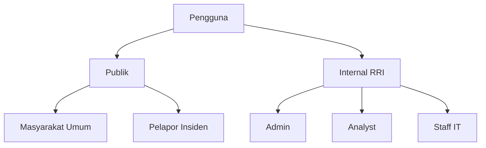
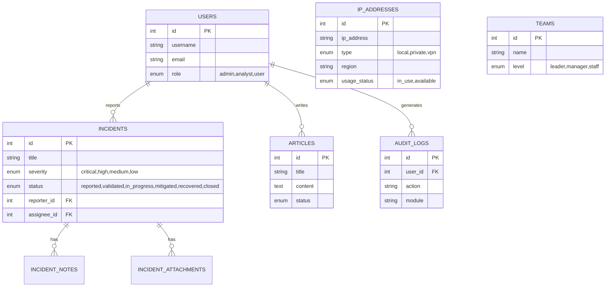

# CSIRT RRI Application Blueprint

## Dokumen Arsitektur & Spesifikasi Aplikasi
**Versi**: 1.1  
**Tanggal**: 20 Januari 2026

---

## 1. Konsep Aplikasi

### 1.1 Gambaran Umum
**CSIRT RRI** (Computer Security Incident Response Team Radio Republik Indonesia) adalah aplikasi web untuk mengelola keamanan siber dan respons insiden di lingkungan RRI. Aplikasi ini menggabungkan:

- **Landing Page Publik** - Informasi tentang CSIRT, berita keamanan, dan pelaporan insiden
- **Admin Panel** - Manajemen insiden, pengguna, konten, dan infrastruktur IT

### 1.2 Tujuan Aplikasi

| Tujuan | Deskripsi |
|--------|-----------|
| **Respons Insiden** | Menerima, memvalidasi, dan menangani laporan insiden keamanan siber |
| **Manajemen Infrastruktur** | Monitoring dan pengelolaan IP Address di seluruh daerah |
| **Edukasi Publik** | Menyebarkan informasi keamanan siber melalui artikel |
| **Transparansi** | Menampilkan tim CSIRT dan informasi kontak |
| **Pelaporan** | Menyediakan laporan statistik insiden dan aktivitas |

### 1.3 Target Pengguna



---

## 2. Arsitektur Sistem

### 2.1 Technology Stack

| Layer | Teknologi |
|-------|-----------|
| **Backend** | PHP 7.4+ dengan CodeIgniter 3 |
| **Frontend** | HTML5, Tailwind CSS, Alpine.js |
| **Database** | MySQL 5.7+ |
| **Server** | Apache/Nginx atau PHP Built-in Server |

### 2.2 Struktur Direktori

```
RRI-CSIRT/
├── application/
│   ├── controllers/     # 7 Controllers
│   ├── models/          # Database models
│   ├── views/
│   │   ├── admin/       # Admin panel views
│   │   ├── landing/     # Public pages
│   │   └── templates/   # Reusable templates
│   └── config/          # Konfigurasi aplikasi
├── docs/                # Dokumentasi & Database
│   ├── BLUEPRINT.md     # Dokumen ini
│   └── database.sql     # Skema Database
├── assets/              # CSS, JS, Images
└── system/              # CodeIgniter core
```

---

## 3. Database Schema (ERD)

> **File SQL:** [database.sql](database.sql) - Gunakan file ini untuk import struktur database lengkap.

### 3.1 Tabel Utama dan Relasi



### 3.2 Kategori & Enum Penting

| Enum | Nilai | Deskripsi |
|------|-------|-----------|
| **Severity** | Critical, High, Medium, Low | Tingkat keparahan insiden |
| **Status** | Reported, Validated, In Progress, Mitigated, Recovered, Closed | Lifecycle insiden |
| **Role** | Admin, Analyst, User | Hak akses pengguna |
| **IP Type** | Local, Private, VPN | Jenis jaringan IP |

---

## 4. Fitur Aplikasi

### 4.1 Admin Panel

1. **Dashboard**
   - Ringkasan statistik (Total, Open, Resolved)
   - Grafik tren bulanan
   - Daftar aktivitas terbaru

2. **Manajemen Insiden**
   - **List View:** Filter status/severity, search, pagination
   - **Create:** Form pelaporan lengkap
   - **Detail:** Timeline, notes, status update, assignment

3. **Infrastruktur (IP Management)**
   - **Unified View:** Semua IP (Local/Private/VPN) dalam satu tabel
   - **Filtering:** Tipe, Region, Status Penggunaan
   - **Status:** Visual indicator (Hijau=Tersedia, Amber=Digunakan)

4. **Manajemen Konten**
   - **Artikel:** Editor berita keamanan
   - **Tim:** Pengaturan anggota tim CSIRT

5. **Administrasi**
   - **Users:** Manajemen akun & role
   - **Audit:** Log aktivitas sistem
   - **Settings:** Konfigurasi global

### 4.2 Landing Page

1. **Home:** Hero banner, stats, news ticker, weather widget
2. **Layanan:** Informasi layanan CSIRT (Pemberian peringatan, penanganan insiden)
3. **Artikel:** Blog/berita keamanan siber
4. **Profil:** Tentang CSIRT dan Tim
5. **Kontak:** Informasi lokasi dan form kontak

---

## 5. User Interface (UI) Blueprints

### 5.1 Dashboard Admin

```
┌─────────────────────────────────────────────────────────────┐
│  CSIRT RRI           [Search...]           🔔  [User ▼]     │
├──────────────┬──────────────────────────────────────────────┤
│              │  Dashboard                                   │
│  [Dashboard] │  ┌───────┐  ┌───────┐  ┌───────┐  ┌───────┐  │
│  Incidents   │  │ Total │  │ Open  │  │ High  │  │ Reslv │  │
│  Articles    │  │  152  │  │  12   │  │   3   │  │  140  │  │
│  Teams       │  └───────┘  └───────┘  └───────┘  └───────┘  │
│  IP Mgmt     │                                              │
│  ----------- │  ┌────────────────────────┐  ┌────────────┐  │
│  Users       │  │                        │  │ Recent Act │  │
│  Audit       │  │     Incident Trend     │  │ - Login    │  │
│  Settings    │  │   [Graph Area]         │  │ - Upd IP   │  │
│              │  │                        │  │ - New Inc  │  │
│              │  └────────────────────────┘  └────────────┘  │
└──────────────┴──────────────────────────────────────────────┘
```
*Tampilan dashboard dengan sidebar navigasi, statistik utama, grafik tren, dan aktivitas terbaru.*

### 5.2 IP Management (Unified View)

```
┌─────────────────────────────────────────────────────────────┐
│  Manajemen IP Address                                       │
│                                                             │
│  [Search IP/Name...] [Filter Type ▼] [Region ▼] [Status ▼]  │
│                                                             │
│  ┌───────────────────────────────────────────────────────┐  │
│  │ No | Tipe   | Nama       | IP Addr    | Region | Sts  │  │
│  ├────┼────────┼────────────┼────────────┼────────┼──────┤  │
│  │ 1  │ [Loc]  | Svr Utama  | 192.168.1.1| JKT    | [Use]│  │
│  │ 2  │ [Priv] | Router Bdg | 10.10.1.1  | BDG    | [Use]│  │
│  │ 3  │ [VPN]  | VPN Medan  | 172.16.1.1 | MDN    | [Avl]│  │
│  └────┴────────┴────────────┴────────────┴────────┴──────┘  │
│                                          < 1 2 3 >          │
└─────────────────────────────────────────────────────────────┘
```
*Tampilan manajemen IP terpadu dengan filter lengkap dan indikator tipe visual.*

### 5.3 Incident Detail

```
┌─────────────────────────────────────────────────────────────┐
│  < Back   Insiden #123: Malware Attack          [Action ▼]  │
├────────────────────────────────┬────────────────────────────┤
│                                │                            │
│  Status: [In Progress] [High]  │  History Timeline          │
│                                │                            │
│  **Deskripsi**                 │  o 14:00 - Closed by Admin │
│  Terdeteksi adanya malware     │  |                         │
│  pada server keuangan...       │  o 12:30 - Mitigated       │
│                                │  |                         │
│  **Metadata**                  │  o 10:15 - Status Update   │
│  Kategori: Malware             │  |                         │
│  Sistem: SVR-FIN-01            │  o 09:00 - Reported        │
│  Pelapor: User A               │                            │
│                                │  [Add Note...]             │
│  **Lampiran**                  │                            │
│  [log_file.txt] [screen.png]   │                            │
└────────────────────────────────┴────────────────────────────┘
```
*Halaman detail insiden dengan timeline aktivitas di sidebar kanan.*

---

## 6. Deployment & Konfigurasi

### 6.1 Persyaratan Sistem
- PHP 7.4 - 8.2
- MySQL 5.7+ / MariaDB 10.x
- Web Server (Apache/Nginx/IIS)

### 6.2 Instalasi Database
1. Buat database baru: `rri_csirt`
2. Import file schema: `docs/database.sql`
3. Konfigurasi koneksi di `application/config/database.php`

```php
$db['default'] = array(
    'dsn'   => '',
    'hostname' => 'localhost',
    'username' => 'root',
    'password' => '',
    'database' => 'rri_csirt',
    // ...
);
```

---
*Dokumen Blueprint CSIRT RRI v1.1*
